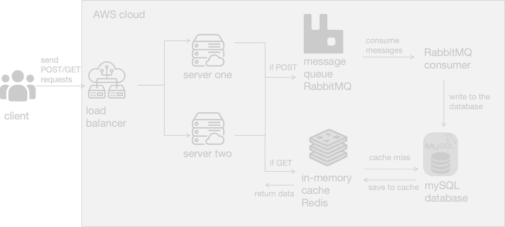
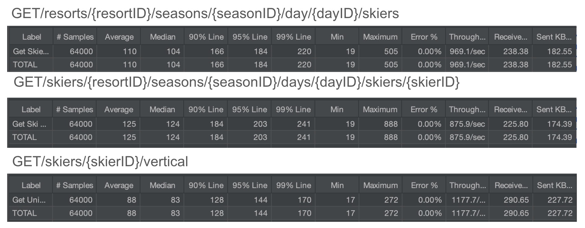
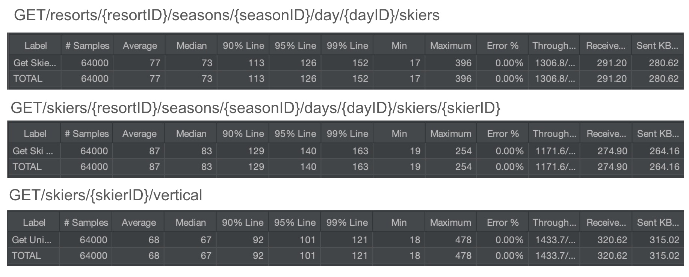

# Distributed Skier Lift Ride System

This program is built with RabbitMQ, Redis, mySQL database ,and AWS services to record skier lift ride events. It mainly focuses on improving the metrics like throughputs and latencies. It is guided by the idea of building a scalable distributed system.

## Architecture --- How Microservices Communicate

There are two main flows in this small system.

**POST Request Flow (Write Path):**

Client sends a POST request to the load balancer => 

Load balancer distributes the request to either server one or server two =>

The server processes the POST request and sends messages to the RabbitMQ queue =>

The RabbitMQ consumer consumes the message and writes the data to the MySQL database

**GET Request Flow (Read Path):**

Client sends a GET request to the load balancer =>

Load balancer routes the request to either server one or server two =>

The server checks the Redis in-memory cache for the requested data =>

If data is found in cache (cache hit), it's returned directly to the client. If data isn't in cache (cache miss), the server fecthes it from MySQL database =>

The fectched data is then saved to Redis cache for future requests =>

Finally, the data is returned to the client

## JMeter test results for GET requests

### use one server

### use load balancer

